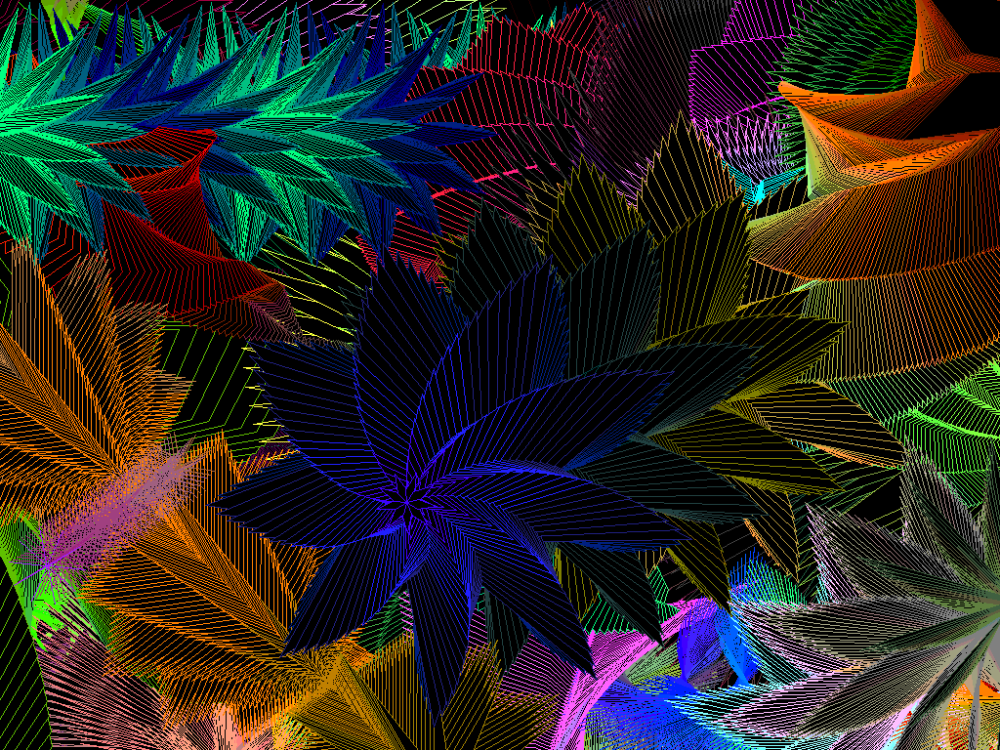



## Exploding Flowers

### Description

There was a rash of polygon screen savers appearing here so I thought I'd make one that is at LEAST nice to look at! This isn't a screen saver yet just the fun part. Will mezmorize you for minutes on end. Uses the polygon API. ** See the full screen saver version here: http://www.planet-source-code.com/vb/scripts/ShowCode.asp?txtCodeId=52391&lngWId=1
 
### More Info
 

             |
---                |---
**Submitted On**   |2004-03-08 21:59:48
**By**             |[Paul Bahlawan](https://github.com/Planet-Source-Code/PSCIndex/blob/master/ByAuthor/paul-bahlawan.md)
**Level**          |Beginner
**User Rating**    |4.9 (158 globes from 32 users)
**Compatibility**  |VB 5\.0, VB 6\.0
**Category**       |[Graphics](https://github.com/Planet-Source-Code/PSCIndex/blob/master/ByCategory/graphics__1-46.md)
**World**          |[Visual Basic](https://github.com/Planet-Source-Code/PSCIndex/blob/master/ByWorld/visual-basic.md)
**Archive File**   |[Exploding\_171809392004\.zip](https://github.com/Planet-Source-Code/paul-bahlawan-exploding-flowers__1-52254/archive/master.zip)

